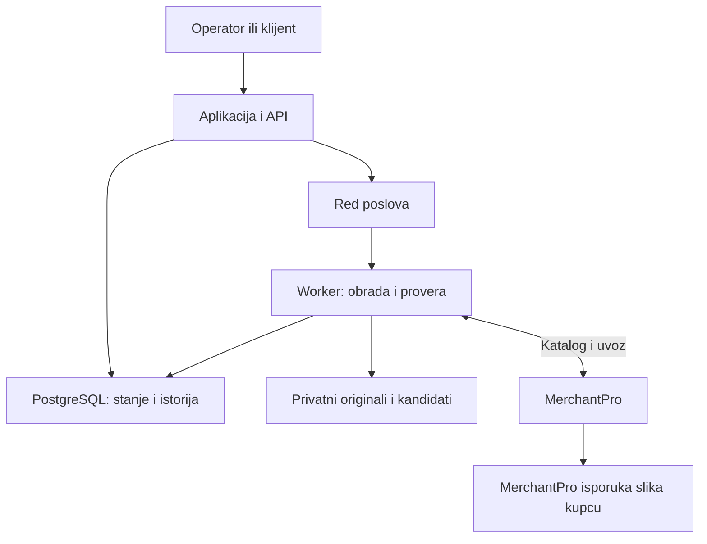

# MerchantPro: nova procena ideje i implementacioni plan

**Pripremljeno za Ivana Bradića · 6. septembar 2026.**

Polazni materijal je priložena konverzacija „Pasted markdown.md“. Procena je dopunjena javnom dokumentacijom i tržišnim podacima dostupnim na dan izrade. Ovde nisu izvršeni API pozivi nad konkretnom prodavnicom, optimizovane njene slike niti izmereno ubrzanje. Rezultati, rokovi, cene i pragovi označeni kao predlozi služe za validaciju; nisu ostvareni rezultati ili obećanja.

**Dopuna pravca na osnovu nastavka razgovora:** prva faza sada je uporedna analiza MerchantPro prodavnica, mogućnosti platforme i ponovljivih problema. Slike su jedna od hipoteza, a izbor MVP-a dolazi nakon analize. Protokol je dodat u odeljku 15. Detalji razvoja i cene vezane za slike ostaju razrađen scenario ako ta hipoteza prođe proveru.

## 1. Odluka koju bih doneo danas

**Vredi uložiti prvih 20–30 sati u proveru ideje. Još nema dovoljno dokaza za ulaganje u kompletan SaaS.**

Najperspektivniji početak je specijalizovana usluga za MerchantPro, podržana sopstvenim alatom: pronađeš konkretan problem, primeniš proverenu intervenciju i izmeriš rezultat. Pretplata dolazi kada pokažeš da isti kupac redovno dobija novu vrednost.

Ranija konverzacija bila je previše optimistična u tri tačke: tretirala je WebP kao dovoljno jaku razliku u odnosu na platformu, podrazumevala bezbednu zamenu postojećih slika i potcenila posao potreban za pouzdan proizvod. Tvoje iskustvo sa MerchantPro i SEO radom jeste prednost. Ono daje dobru polaznu hipotezu, ali još ne dokazuje ni dodatno ubrzanje ni spremnost kupca da plaća svakog meseca.

| Varijanta ideje | Moja procena | Odluka |
| --- | --- | --- |
| Konverzija kataloga u WebP | Slaba samostalna diferencijacija | Ne graditi proizvod samo oko formata |
| Jednokratna optimizacija uz audit i dokaz rezultata | Dobar kandidat za prvu naplativu uslugu | Proveriti na malom uzorku |
| Automatska obrada novih slika i praćenje pogoršanja | Moguć mali SaaS ako postoji ponavljajuća potreba | Razvijati posle plaćenih pilota |
| Opšta platforma za slike, JS, keš, SEO i sve probleme | Preširok početni obim | Svaku novu funkciju zasebno validirati |

**Predloženo pozicioniranje:** održavanje performansi MerchantPro prodavnica uz merljive intervencije i istoriju promena. Prvi proizvod treba da rešava samo jedan dokazano ponovljiv problem.

## 2. Šta provereni izvori menjaju u ranijoj priči

### WebP već postoji

MerchantPro je 24. maja 2021. objavio automatsku kompresiju i isporuku produktnih slika kao WebP za podržane pregledače. To ne dokazuje da je svaka današnja prodavnica dobro podešena, ali uklanja pretpostavku da sama WebP konverzija predstavlja novu funkciju. [MerchantPro: objava WebP funkcionalnosti](https://www.merchantpro.ro/blog/functionalitati/lansarile-lunii-mai-in-platforma-merchantpro-conversie-imagini-in-format-webp-integrare-facebook-conversion-api-si-multe-altele).

URL sa nastavkom `.jpg` nije dovoljan dokaz formata isporučenog fajla. Pregledaj `Content-Type`, stvarni sadržaj odgovora i način pregovaranja formata preko HTTP zaglavlja. Uopšteno, jedan URL može predstavljati različite reprezentacije sadržaja zavisno od zahteva. [MDN: content negotiation](https://developer.mozilla.org/en-US/docs/Web/HTTP/Guides/Content_negotiation).

Zato poredi postojeću sliku preuzetu u realnom prikazu prodavnice sa novom slikom preuzetom iz istog prikaza posle MerchantPro obrade. Poređenje izvornog JPEG-a sa lokalnim WebP-om samo po sebi ne potvrđuje korist za kupca.

### Eksterna integracija je dokumentovana

REST API koristi domen prodavnice i putanju `/api/v2/`. API korisnik se kreira u `Settings → API and webhooks → API Users`, uz izbor dozvola. Za prvi konektor odabrao bih dokumentovani Basic Auth sa API korisnikom i tajnom preko HTTPS-a. Kredencijali se koriste na tvom serveru. [MerchantPro: API overview](https://docs.merchantpro.com/api/).

Zvanični App Store je poseban distribucioni put: dokumentacija traži partnerstvo, ugovor i pregled aplikacije, navodi moguće naknade i trenutno odsustvo privatnih aplikacija ograničenih na jedan nalog. Endpointi aplikacije hostuju se na sopstvenom serveru. [MerchantPro: App Development](https://docs.merchantpro.com/app-development/).

Postoji i OAuth 2.1, ali dokumentacija ga opisuje za MCP i SSO klijente; klasični REST kredencijali i postojeći App Store proces ostaju odvojeni. Ne treba pretpostaviti da MCP OAuth token automatski rešava REST integraciju optimizatora. [MerchantPro: OAuth 2.1](https://docs.merchantpro.com/api/oauth2/).

### Rad sa slikama ima konkretno ograničenje

Dokumentovani image endpointi su:

| Operacija | Endpoint, posle `/api/v2` |
| --- | --- |
| Čitanje galerije | `GET /products/{id}/images` |
| Dodavanje preko URL-a ili base64 sadržaja | `POST /products/{id}/images` |
| Izmena opisa i dodatnih polja | `PATCH /products/{id}/images/{file_id}` |
| Brisanje pojedinačne slike | `DELETE /products/{id}/images/{file_id}` |

Dodavanje preko URL-a ide kroz red za uvoz. Slanje `images` u izmeni proizvoda takođe dodaje slike. Image PATCH nije dokumentovan kao zamena binarnog sadržaja. Očuvanje postojećeg ID-a, URL-a, glavne slike i redosleda pri zameni ostaje uslov za praktični test. [MerchantPro: Products API](https://docs.merchantpro.com/api/endpoints/products/).

### Postoji pristup temi, uz ograničenja

Themes API omogućava rad sa izvornim fajlovima teme uz dozvolu `templates`. Podržava pregled, izmenu i objavljivanje, uz dozvole po fajlu. Neke putanje se automatski objavljuju. Operacija `restore` vraća podrazumevanu verziju platforme, što nije isto što i vraćanje prethodne klijentove verzije. [MerchantPro: Themes API](https://docs.merchantpro.com/api/endpoints/themes/).

To otvara mogućnost kasnijih ciljanih intervencija u prikazu i učitavanju slika. Ne daje neograničenu kontrolu nad infrastrukturom, svim sistemskim skriptama ili serverskim keširanjem.

### Loš PageSpeed rezultat nije dokaz uzroka pada SEO saobraćaja

LCP zavisi od više delova učitavanja: odgovora servera, početka preuzimanja resursa, trajanja preuzimanja i prikazivanja elementa. Manji fajl ne mora smanjiti LCP ako prikaz i dalje čeka JavaScript. [Google/web.dev: optimizacija LCP-a](https://web.dev/articles/optimize-lcp).

Slični rezultati na više MerchantPro prodavnica jesu razlog za istraživanje zajedničkog uzroka. Za pripisivanje uzroka platformi treba odvojiti njene resurse od teme, slika koje je uneo trgovac, tagova, aplikacija i drugih dodataka. Pad saobraćaja nakon migracije dodatno zahteva proveru URL-ova, redirekcija, indeksacije, canonical oznaka i sadržaja.

Google ne podržava `crawl-delay` u robots.txt. Njegovo prisustvo ne treba predstavljati kao dokaz da Googlebot zbog toga čeka pet sekundi. [Google: robots.txt specifikacija](https://developers.google.com/crawling/docs/robots-txt/robots-txt-spec).

## 3. Tržište, kupac i poslovni model

Store Leads u izveštaju ažuriranom 28. avgusta 2026. detektuje **2.231 aktivnu MerchantPro prodavnicu**, uključujući **1.875 u Rumuniji i 138 u Srbiji**. To je procena njihovog sistema detekcije, a ne potvrđen broj kupaca dostupnih tvom proizvodu. [Store Leads: MerchantPro u 2026](https://storeleads.app/reports/merchantpro).

Srpski cenovnik navodi API pristup u VIP paketu i nasledno višem paketu. Uslove konkretnog naloga treba proveriti tokom kvalifikacije kupca. [MerchantPro Srbija: paketi](https://www.merchantpro.rs/plans).

Zaključak iz ovih podataka: Srbija je dobar teren za prve razgovore i studiju slučaja; veći broj pretplatnika verovatno zahteva i Rumuniju ili partnerski kanal. Javni spisak referenci je polazna lista. Potrebno je utvrditi ko je aktivan, ima API pristup, problem koji tvoj alat rešava i budžet.

**Početni istraživački uzorak:** MerchantPro prodavnice različite veličine, sa različitim temama i dodacima. Posle analize bira se uži segment prema stvarno pronađenom problemu. Ako se potvrdi hipoteza o slikama, mogući segment su prodavnice sa približno 1.000–10.000 proizvoda i čestim uvozom dobavljačkih fotografija. Ukupan broj proizvoda nije samostalan kriterijum loših performansi.

| Kandidat | Zašto bi platio | Šta proveriti |
| --- | --- | --- |
| Prodavnica sa redovnim velikim uvozima | Manje ručne obrade i ponavljanja grešaka | Broj novih ili izmenjenih slika mesečno |
| Prodavnica sa problematičnim prikazom fotografija na mobilnom | Brži ili pravilniji prikaz ključnih stranica | Da li uzrok možeš da menjaš dostupnim pristupom |
| Agencija koja održava više MerchantPro prodavnica | Ušteda rada na više naloga | Može li se postupak ponoviti bez posebnog razvoja za svaku temu |
| Mali katalog koji se retko menja | Povremeno sređivanje | Verovatnije jednokratna usluga ili paket obrade |

Konkurencija uključuje postojeću platformsku obradu, MerchantPro podršku, rad interne osobe i druge alate za katalog. Na primer, MicroPIM dokumentuje MerchantPro integraciju koja obuhvata i slike. To nije dokaz da nudi isto merenje performansi, ali pokazuje da eksterna sinhronizacija kataloga već postoji. [MicroPIM: MerchantPro integracija](https://docs.micropim.net/integrations/merchant-pro/).

Tvoja moguća prednost je paket pouzdane integracije, poznavanja platforme, vizuelne kontrole, vraćanja promena i dokazivanja koristi. Algoritam kompresije sam po sebi nije dovoljna prepreka konkurenciji.

### Validacija potražnje

1. Sastavi 30 kvalifikacionih zapisa: okvirno 15 Srbija i 15 Rumunija, ako javni podaci omogućavaju takav uzorak.
2. Za 10 pregledaj po tri reprezentativna URL-a. Zabeleži konkretan problem i koliko je zaključak pouzdan.
3. Obavi 10 razgovora, uključujući najmanje tri rumunska trgovca ili agencije. Cilj je razumevanje postojećeg postupka, učestalosti problema i budžeta.
4. Ponudi jasno ograničen plaćeni pilot kada za konkretnu prodavnicu imaš dokaz tehničke izvodljivosti.
5. Traži tri plaćena pilota. Besplatno testiranje u firmi u kojoj radiš daje tehnički dokaz, ali nije nezavisna validacija prodajne cene.

U razgovorima pitaj: koliko se slika menja mesečno; ko ih sređuje; koliko vremena to uzima; šta su već pokušali; šta im rešava platforma; da li bi pre platili jedno sređivanje ili trajno održavanje; koji rezultat opravdava cenu. Pitanje „da li ti se dopada ideja?“ ima malu vrednost bez konkretnog postupka i ponude.

## 4. Četiri uslova za nastavak

Sledeći pragovi su **predložene interne granice ulaganja**, ne industrijski standardi. Zapiši ih pre eksperimenta i nemoj ih menjati samo da bi rezultat izgledao uspešno.

| Uslov | Dokaz za nastavak | Ako dokaz izostane |
| --- | --- | --- |
| G1: Ponovljiv problem | Najmanje tri nezavisne prodavnice imaju isti rešiv problem koji ostaje nakon provere nativnih mogućnosti | Suzi ili promeni hipotezu |
| G2: Korist | Na najmanje dve od tri testirane prodavnice dobijaš unapred dogovorenu vrednost | Ne praviti automatski proizvod za taj problem |
| G3: Pouzdanost | Kontrolisani uvoz, očuvana galerija i kvalitet, potvrđena procedura vraćanja, bez neočekivanih promena proizvoda | Zadrži analizu i ručni rad; zaustavi masovne izmene |
| G4: Plaćanje i ponavljanje | Tri plaćena pilota; za pretplatu najmanje dva obnove i pokažu novu korist u sledećem ciklusu | Jednokratna usluga ili plaćanje po obradi |

Za G2 bih unapred izabrao jedan glavni cilj po ponudi:

- **Optimizacija slika:** najmanje 20% manje stvarno preuzetih bajtova slika na ciljanim stranicama, uz koristan apsolutni iznos, npr. najmanje 200 KB na tipičnoj ciljanoj stranici. Bez gubitka prihvatljivog kvaliteta i bez pogoršanja funkcionalnosti.
- **Ubrzanje prikaza:** na stranicama gde je LCP problem, medijana laboratorijskog LCP-a bolja najmanje 15% i najmanje 300 ms, uz ponovljiv rezultat iz više izvršavanja.
- **Automatizacija rada:** dokumentovana ušteda najmanje dva sata mesečno kod trgovca koji stvarno obavlja taj posao, uz prihvatljivu cenu i isti kvalitet izlaza.

Ušteda bajtova sama po sebi nije dokaz ubrzanja prikaza. Ako prodaješ brzinu, proveravaj brzinu. Ako prodaješ uštedu rada, meri vreme rada i broj intervencija.

## 5. Predloženi put integracije

Za V0 i prve pilote izabrao bih **eksternu aplikaciju sa posebnim API korisnikom za svaku prodavnicu**. Prva verzija može biti komandni alat kojim upravljaš ti; klijentski interfejs nije uslov za proveru.

| Put | Uloga u planu | Preduslov |
| --- | --- | --- |
| REST kredencijali trgovca | Početni način povezivanja | Nalogu je omogućen API i trgovac dodeljuje odgovarajuće dozvole |
| Zvanična App Store aplikacija | Kasnije jednostavnije povezivanje i distribucija | Uslovi partnerstva, pregled aplikacije i procena troškova |
| Themes API | Zaseban modul ako audit dokaže problem u podržanim fajlovima teme | Posebna dozvola i poznate mogućnosti konkretne teme |

Onboarding bih organizovao ovako: unese se HTTPS domen prodavnice, doda namenski API korisnik, izvrši provera veze, pokrene analiza, prikaže izbor intervencija i pregleda predlog prve male grupe promena. Za analizu traži samo čitanje kataloga; pisanje dodaj kada je potrebno. Pristup temi traži samo ako je deo ugovorene intervencije. Nisu potrebni podaci o kupcima i porudžbinama.

**Arhitektonska odluka:** optimizovane slike treba da budu kopirane u MerchantPro i isporučivane njegovim putem. Tvoj servis obrađuje sadržaj van putanje kupčevog zahteva. Nakon potvrđenog uvoza, prekid rada optimizatora ne treba da prekine prikaz već objavljenih slika.

Privremeni URL za uvoz može biti javno dostupan preko nepredvidivog, vremenski ograničenog linka. Mora ostati važeći dovoljno dugo za red, preuzimanje i eventualna ponavljanja. Ne koristi takav link kao trajni `src` slike u prodavnici. Originale čuvaj privatno.

Za objavljivanje zvanične aplikacije kasnije pripremi manifest, tražene dozvole, callback za prestanak korišćenja, test prodavnicu i postupak podrške. Najpre traži uslove partnerstva i cenu od platforme; sama javna dokumentacija ne predstavlja odobrenje tvoje aplikacije.

## 6. Eksperiment pre razvoja proizvoda

### 6.1. Najpre utvrdi šta kupac stvarno preuzima

Za svaku detaljno testiranu prodavnicu uzmi šest URL-ova: početnu stranicu, dve kategorije i tri stranice proizvoda. Uoči da glavni baner i produktna slika ne moraju pripadati istom sistemu obrade. Katalog slika nije isto što i sve slike sajta.

Za svaku sliku u ciljnom prikazu zabeleži:

- URL iz `currentSrc`, `srcset` i `sizes`, stvarni MIME tip i preuzete bajtove;
- fizičke dimenzije fajla, prikazanu širinu i visinu, viewport i odnos fizičkih i CSS piksela;
- da li je slika LCP element, kada počinje njen zahtev i šta odlaže prikaz;
- stanje browser keša, odgovor CDN-a kada su relevantna zaglavlja dostupna i profil zahteva;
- razliku između resursa u početnom prikazu i galerije učitane tek posle skrolovanja ili interakcije.

Za automatizovanu analizu preuzetih bajtova predložen je Playwright sa mrežnim zapisom browsera. Ne tretiraj `transferSize = 0` kao besplatnu sliku: vrednost može biti posledica keša ili ograničenja vidljivosti cross-origin merenja. Čuvaj mrežni zapis i navedi metodu merenja.

Odvojeno evidentiraj: veličinu sačuvanog izvora, veličinu svog kandidata, veličinu koju posle uvoza šalje MerchantPro i zbir bajtova na stranici. Samo poslednje dve kategorije pokazuju šta se promenilo za posetioca.

### 6.2. Kontrola koja sprečava pogrešan zaključak

U test prodavnici uporedi tri slučaja sa istim vizuelnim sadržajem:

| Slučaj | Svrha |
| --- | --- |
| A: postojeći sadržaj kroz nativnu isporuku | Početno stanje |
| B: ponovo unet isti, neizmenjen izvor | Izoluje efekat ponovne obrade i osvežavanja platforme |
| C: tvoj optimizovani kandidat | Pokazuje dodatnu korist tvoje obrade u odnosu na B |

Ako B daje isti rezultat kao C, poslovna prilika može biti pomoć pri osvežavanju ili podešavanju kataloga. Nije opravdano svu korist pripisati sopstvenom algoritmu.

Testiraj različite vrste fotografija: JPEG fotografiju, PNG sa providnošću, sliku sa sitnim tekstom, teksture i detalje, veoma veliki izvor i sliku koja je već dobro optimizovana. U prvoj grupi preskoči animacije, SVG, 360 galerije i slike povezane sa varijantama dok njihove veze nisu posebno potvrđene.

### 6.3. Merenje rezultata

Koristi istu verziju Lighthouse-a, browsera, server merenja, mobilni profil i sadržaj stranice. Po URL-u izvrši pet merenja pre i pet posle promene. Prikaži medijanu i raspon. Za ključno poređenje koristi prazan browser keš uz uporedivo zagrejan CDN; posete sa zagrejanim browser kešom prikaži zasebno. Izbegni poređenje nezagrejanog novog URL-a sa dugo keširanim starim resursom bez objašnjenja.

U kontrolisanom testu ne menjaj istovremeno temu, tagove i slike. Ostavi i grupu neizmenjenih stranica radi poređenja sa opštim promenama uslova. Za završnu potvrdu koristi malu, dogovorenu grupu na stvarnom sajtu, jer staging ne mora imati istu isporuku kao produkcija.

| Metrika | Kako se koristi |
| --- | --- |
| Bajtovi slika na definisanim stranicama | Glavni dokaz uštede prenosa |
| LCP medijana i raspon | Dokaz promene u prikazu glavnog sadržaja |
| CLS i ponašanje galerije | Otkrivanje pogoršanja prikaza |
| TBT u laboratoriji | Dijagnostika blokiranja tokom testiranog učitavanja |
| LCP, CLS i INP stvarnih poseta | Naknadna potvrda iskustva korisnika kada podaci postoje |
| Vreme ručne obrade i podrške | Dokaz poslovne koristi i održivosti usluge |

PSI razlikuje laboratorijske rezultate i CrUX podatke stvarnih korisnika za prethodnih 28 dana. URL može imati premalo podataka pa se prikazuje origin; to mora biti jasno označeno. Jedan navigacioni Lighthouse test ne predstavlja merenje stvarnog INP-a korisnika. Ako nema terenskih podataka, napiši „nema dovoljno podataka“. [Google: About PageSpeed Insights](https://developers.google.com/speed/docs/insights/v5/about).

**Ne obećavaj procenat rasta SEO saobraćaja, konverzija ili PageSpeed rezultat 90+.** To nisu ishodi koje ovaj kontrolisani eksperiment može garantovati. Praćenje prihoda zahteva zaseban plan i dovoljan uzorak.

## 7. Tehnički POC: dokaz bezbedne promene

Počni sa test nalogom ili eksplicitno odobrenim testnim proizvodima. Prodavnica firme u kojoj radiš nije automatski tvoj razvojni sandbox; za promene i korišćenje rezultata kao studije slučaja dogovori obim sa vlasnikom. Za ovaj plan pristup toj prodavnici nije korišćen.

### 7.1. Minimalni obim

Pet do deset test proizvoda, ukupno oko 20–30 slika. Komandni alat mora da izvrši: inventar, backup, lokalnu obradu, pregled kandidata, kontrolisan uvoz, proveru prikaza i probno vraćanje. Bez korisničkog panela i automatske naplate.

Mehanizam prvo proveri na jednom test nalogu. Korist potom ponovi u tri nezavisne prodavnice kroz odobrene probne intervencije i pilote. Tri kopije iste demo prodavnice nisu tri nezavisna dokaza. Početni POC može opravdati ograničeni razvoj V0; klijentski proizvod čeka potvrdu G2 na pilotima.

| Nepoznanica | Test | Uslov prolaza |
| --- | --- | --- |
| Pravi original ili već izvedena slika | Uporedi API resurs sa master fajlom vlasnika i njegovim dimenzijama | Poznato je šta backup čuva; izvedena slika nije označena kao master |
| Podržani formati i granice uvoza | Mali kontrolisani uvozi različitih tipova i veličina | Konektor zna šta prihvata, a šta preskače |
| Asinhroni uvoz | Prati prihvaćen zahtev do vidljivog resursa | Uspeh se prijavljuje tek posle potvrđenog prikaza |
| Glavna slika i redosled | Zameni jedan primer po potvrđenom postupku platforme | Nema pogrešne glavne slike ni trajnih duplikata |
| Identitet i URL | Zabeleži stare i nove veze i posledice uvoza | Poznato je šta se zadržava, a šta se menja |
| Povezani prikazi | Proveri karticu, stranicu proizvoda, zoom, korpu i relevantni feed | Svi prikazi imaju ispravnu sliku |
| Vraćanje | Namerno vrati probnu promenu | Povratak kvaliteta i veza je potvrđen, uz dokumentovana ograničenja |

**Najvažniji uslov:** nije dovoljno da uspeju POST nove slike i DELETE stare. Moraš dokazati kako se bezbedno aktivira zamena u galeriji. Ako postoji samo dodavanje koje proizvodi nepredvidiv redosled, automatizacija postojećeg kataloga još nije spremna.

Prisustvo polja `position` u odgovoru ne znači da ga isti endpoint prihvata za izmenu. Ne implementiraj pretpostavljeni endpoint za reorder, zamenu sadržaja ili izbor glavne slike. Zatraži potvrđen postupak platforme i proveri ga na testnim proizvodima.

### 7.2. Predloženi tok jedne promene

1. Učitaj najnovije stanje proizvoda i galerije; sačuvaj veze, redosled, opise i identifikatore.
2. Preuzmi raspoloživi izvor; sačuvaj bytes, sopstveni SHA-256 i podatak da li je master ili derivat. Proveri da backup može da se pročita i dekodira.
3. Napravi kandidata iz sačuvanog izvora. Sačuvaj verziju pravila obrade i očekivani cilj.
4. Prikaži poređenje operatoru i odobri malu grupu za uvoz.
5. Ponovo proveri stanje galerije. Ako se promenila, zaustavi posao kao konflikt.
6. Uvezi kandidata i upiši da je zahtev poslat. Sačekaj dok platforma ne završi kopiranje.
7. Poveži rezultat sa svojim poslom, proveri isporučeni fajl i vizuelni kvalitet, pa izvrši samo prethodno dokazan postupak aktivacije.
8. Proveri povezane prikaze i rezultat merenja. Tek tada proglasi promenu završenom.
9. Uklanjanje stare slike dozvoli samo kada su postupak vraćanja i posledice po URL-ove prihvaćeni za taj tip intervencije.

Ako privremeno dodavanje pravi vidljive duplikate, to je ograničenje postupka koje mora biti rešeno ili unapred dogovoreno za mali pilot. Ne prikazuj ga kao potpuno neprimetnu atomsku zamenu.

### 7.3. Šta rollback znači

Backup fajla nije automatski backup identiteta slike. Ponovni uvoz može proizvesti novi ID ili URL. Ako platforma ne podržava očuvanje starog identiteta, ne obećavaj vraćanje starih javnih adresa. Za prodavnice kojima su te adrese kritične, to može biti razlog da se obrada postojećeg kataloga ne uključi.

Tokom probnog perioda čuvaj originale i mapu promena. Ako je stari resurs još raspoloživ, koristi ga za povratak po proverenom postupku. Ako je uklonjen, vrati sačuvani sadržaj i sve podržane veze, pa proveri novi prikaz i feedove. Tuđi naknadno uneti sadržaj ne prepisuj starim snapshotom celog proizvoda.

Predlog politike čuvanja: originali dok je usluga aktivna; posle otkazivanja 30 dana za izvoz i dogovoreni rollback, zatim brisanje prema ugovorenom pravilu. Veliki katalozi zahtevaju zaseban limit prostora. Ovo je predlog usluge koji treba uskladiti sa troškovima i kupcem.

## 8. V0 i prvi MVP: šta tačno graditi

Ovaj odeljak razrađuje scenario u kome analiza izabere obradu slika kao prvi proizvod. Za problem u temi, tehničkom SEO-u ili radu sa katalogom obim MVP-a i razvojne sate treba prilagoditi konkretnom nalazu.

### 8.1. Obim

| Funkcija | V0, interni alat | MVP posle pilota |
| --- | --- | --- |
| Povezivanje prodavnice | Namenski kredencijali, operator | Vođen onboarding i provera dozvola |
| Analiza | Inventar i izveštaj po uzorku | Filtriranje kandidata i istorija |
| Obrada | Konzervativna pravila, eksplicitna grupa | Pravila po prodavnici i tipovima slika |
| Pregled pre promene | Lokalni pregled i manifest | Poređenje pre/posle i odobravanje grupe |
| Pouzdanost | Backup, checkpoint, ograničen broj zahteva, dnevnik | Trajni red poslova, oporavak i jasne greške |
| Vraćanje | Proveren postupak po slici i grupi | Dostupan kroz interfejs, sa stvarnim ograničenjima |
| Automatizacija novih slika | Pokretanje po rasporedu pod nadzorom | Uključivanje po prodavnici tek nakon validacije |
| Naplata | Ručno evidentiranje pilota | Pretplata ili paket obrade |

Za početnu verziju izostavi opšti JS optimizer, sopstveni CDN, proxy ispred prodavnice, univerzalni SEO skor, AI pisanje sadržaja, više platformi i automatsko menjanje svih fajlova teme. Ti dodaci ne rešavaju prva četiri uslova za nastavak.

### 8.2. Tehnologije koje bih izabrao za tebe

| Komponenta | Predlog | Obrazloženje |
| --- | --- | --- |
| Jezik | TypeScript | Kontinuitet sa tvojim JavaScript/Angular znanjem |
| Početni program | Node.js komandni alat | Brza provera bez UI sloja |
| Serverska aplikacija | NestJS, kada dodaš HTTP interfejs | Jedna organizovana aplikacija; odvojeni moduli za integraciju i poslove |
| Klijentski interfejs | Angular | Koristi postojeće znanje; nema poslovne potrebe za prelaskom na React |
| Baza | PostgreSQL | Trajno stanje poslova, istorija i odvajanje prodavnica |
| Obrada slika | Sharp/libvips | Lokalna obrada fajlova u Node okruženju |
| Red poslova | BullMQ i Redis | Worker može da radi van trajanja HTTP zahteva |
| Fajlovi | Privatni objektni storage | Originali i kandidati van baze |
| Provera prikaza | Playwright i Lighthouse | Povezuje funkcionalnu proveru sa merenjem stranica |

Sharp podržava obradu različitih formata i promenu dimenzija. Verziju biblioteke i pravila treba fiksirati po izdanju, a odgovarajući format i veličinu birati prema sadržaju i testu. [Sharp: dokumentacija](https://sharp.pixelplumbing.com/), [Sharp: resize](https://sharp.pixelplumbing.com/api-resize/).

Repozitorijum može imati module `connector`, `image-processing`, `measurements` i `shared`, uz programe `cli`, `api`, `worker` i kasnije `web`. To je jedna kodna baza. API i worker jesu odvojeni procesi, ali ne treba praviti mrežu mikroservisa.

### 8.3. Pravila obrade

- Već dobro optimizovane slike preskoči. Evidentiraj razlog; preskakanje je ispravan rezultat.
- Ne smanjuj sve fotografije na 1.200 px. Potrebna rezolucija zavisi od najvećeg prikaza, zoom-a i kvaliteta izvora.
- Zadrži odnos stranica, providnost i prihvatljiv prikaz boja. Proveri orijentaciju pre uklanjanja metapodataka.
- Ne uvećavaj male izvore. Grafiku sa sitnim tekstom i osetljivim detaljima usmeri na posebna pravila ili ručni pregled.
- Uporedi nekoliko konzervativnih kandidata. Kvalitet 80 je polazni parametar za test, ne univerzalno pravilo.
- Kada nativna obrada već daje dobar WebP, proveri da li kvalitetniji JPEG ili PNG ulaz daje bolji konačan rezultat. Ne insistiraj na WebP-u kao ulaznom fajlu.
- Ponovno pokretanje obrađuje sačuvani izvor uz novu verziju pravila, a ne prethodno kompresovani izlaz.
- Automatski objavljuj samo tipove sadržaja za koje su kvalitet i krajnja isporuka već potvrđeni.

### 8.4. Podaci koji su potrebni

| Entitet | Minimalna uloga |
| --- | --- |
| `stores` | Domen, status veze, dozvole, verzija politike i limiti |
| `credentials` | Šifrovani kredencijali i reference na ključeve |
| `catalog_images` | Veza prodavnice, proizvoda i slike, metapodaci i poslednje opaženo stanje |
| `asset_versions` | Privatni put fajla, sopstveni hash, dimenzije, tip izvora i verzija obrade |
| `jobs` i `job_items` | Grupa, ciljna slika, stanje, pokušaji, greška i rezultat |
| `change_sets` | Očekivano početno stanje, nove veze, autor i podaci za vraćanje |
| `measurements` | URL, vreme, uslovi testa, sirovi rezultat i izdvojene metrike |
| `sync_cursors` i `event_inbox` | Napredak sinhronizacije i prihvaćeni događaji |
| `audit_events` | Ko je pokrenuo, odobrio, primenio ili vratio promenu |
| `users` i `store_memberships` | Dodaju se kada interfejs koristi više osoba |

Svaki poslovni zapis vezuj za `store_id` i proveravaj tu vezu pri svakom čitanju, poslu i preuzimanju fajla. ID proizvoda nije globalno jedinstven među prodavnicama. Sačuvaj ovo pravilo od početka; pre drugog klijenta proveri izolaciju podataka i akcija.

## 9. Pouzdano izvršavanje i automatski režim

### 9.1. Stanje posla mora preživeti prekid

Minimalni tok stanja je: `discovered`, `backed_up`, `candidate_ready`, `approved`, `import_requested`, `import_visible`, `cutover_pending`, `verified`. Zasebna stanja su `skipped`, `conflict`, `needs_review`, `failed`, `rollback_pending` i `restored`.

Stanje čuvaj u bazi. Redis služi za dostavu posla workeru, a ne kao jedino mesto koje pamti šta je promenjeno. Pre slanja spoljnog zahteva trajno upiši nameru, a zatim i rezultat. Proces oporavka pronalazi nezavršene poslove i proverava stvarno stanje u prodavnici.

BullMQ preporučuje male poslove čije ponavljanje dovodi do istog krajnjeg stanja. To je važna osnova, ali sama biblioteka ne garantuje da će spoljašnji API poziv biti izvršen tačno jednom. [BullMQ: idempotentni poslovi](https://docs.bullmq.io/patterns/idempotent-jobs).

Predloženi jedinstveni ključ obrade je kombinacija prodavnice, proizvoda, identiteta izvora, SHA-256 izvora i verzije politike. Za promene galerije koristi zaključavanje po proizvodu. Kontrola pre upisa i interni lock ne mogu potpuno ukloniti trku sa tuđim ERP-om ako udaljeni endpoint nema uslovnu atomsku izmenu. Zato pilot mora uključiti i dogovoren period izmene i test konflikta sa drugim izvorom podataka.

### 9.2. Nejasan odgovor API-ja je poseban slučaj

Ako POST istekne, slika je možda ipak prihvaćena. Ne šalji ga ponovo odmah. Prvo proveri galeriju i status prethodnog pokušaja. Za povezivanje rezultata koristi podatke potvrđene POC-om: vraćeni ID kada postoji, razliku resursa pre i posle, prepoznatljiv naziv uvoza i sadržaj.

Sopstveni hash kandidata nije nužno jednak hash-u koji vrati platforma nakon ponovne obrade. Ako rezultat nije moguće jednoznačno povezati, zaustavi posao za ručni pregled. Dupliranje slika nije prihvatljiva cena automatskog retry-a.

Za kratke privremene greške koristi odložena ponavljanja sa rastućom pauzom. Za 401/403 prekini ponavljanje i označi da je potrebno obnoviti vezu. Za neuspešnu validaciju sadržaja preskoči stavku ili traži pregled. Pri prvoj neočekivanoj promeni galerije zaustavi dalja pisanja za tu prodavnicu.

### 9.3. Ograničenja zahteva

Aktuelni API overview navodi 4 zahteva u sekundi, 80 u minutu, 3.600 u satu i 60.000 dnevno, uz napomenu o zavisnosti od paketa i dodatnim ograničenjima. [MerchantPro: API rate limits](https://docs.merchantpro.com/api/#api-rate-limits).

Za pilot bih krenuo sa najviše jednim zahtevom na dve sekunde i jednim aktivnim upisom po prodavnici. To je predložena interna granica, ne garantovano slobodna kvota. Ostavi prostor za druge integracije i prilagodi granicu njihovoj potrošnji. Ograničenje mora važiti zajedno za čitanje, upise, proveru uvoza i oporavak, kroz sve workere te prodavnice.

Kandidate možeš lokalno obrađivati paralelno u skladu sa memorijom servera. Čekanje uvoza koristi odloženi posao, sa ograničenim rokom i kontrolisanim proverama, umesto neprekidnog pozivanja API-ja. Po isteku roka označi uvoz za pregled; to ne znači da je platforma sigurno odbacila zahtev.

### 9.4. Sinhronizacija novih i izmenjenih slika

Prvi automatski režim neka bude periodična provera, npr. svakih 30–60 minuta, uz dnevno usklađivanje inventara. Iskoristi filter izmenjenih proizvoda i paginaciju aktuelnog konektora. Tačnu serijalizaciju filtera proveri u POC-u; ne prepisuj stare primere sa drugačijim nazivima parametara.

Sačuvaj vreme početka svakog skeniranja kao gornju granicu i koristi mali preklop sa prethodnim intervalom. Napredak pomeri tek kada su sve stranice rezultata trajno obrađene. Deduplikacija i dnevno usklađivanje pokrivaju ponovljene zapise, pomeranja tokom paginacije i promene koje nisu stigle kao događaj.

Sačuvaj i identitete konačnih izlaza koje platforma isporuči. Sopstveni uvoz ne sme pri sledećoj sinhronizaciji da postane navodno nova izvorna slika za još jednu kompresiju. Ovu proveru radi nezavisno od datuma izmene proizvoda.

Dokumentovani webhook za proizvode je `product.created`; ne pretpostavljaj da postoji `product.updated`. Webhook provera koristi HMAC-SHA256 nad sirovim telom, base64 potpis i odgovarajuću tajnu. Dokumentacija navodi timeout od pet sekundi, ponovne pokušaje i mogućnost automatske deaktivacije nakon neuspeha. [MerchantPro: webhooks](https://docs.merchantpro.com/webhooks/).

Zato webhook tretiraj kao ubrzanje otkrivanja novog proizvoda. Posle validacije trajno upiši događaj i brzo vrati uspešan odgovor; obradu prepusti workeru. Tajnu biraj iz pouzdane konfiguracije prodavnice/aplikacije. Duplirane događaje prepoznaj, a pre pisanja ponovo učitaj katalog. Periodična provera ostaje potrebna i posle uvođenja webhookova.

Ako dobavljački feed vraća staru sliku, evidentiraj da dva sistema prepisuju jedan drugom rezultat. Posle ponovljenog konflikta pauziraj taj izvor. Rešenje je dogovor o redosledu sinhronizacije ili obrada pre uvoza, a ne beskonačno ponovno kompresovanje.

### 9.5. Minimalna zaštita i nadzor od prvog pilota

Kredencijali se šifruju, ne ulaze u logove i ne vraćaju se browseru. Download servis prihvata samo proverene javne domene i validira DNS/IP adresu i preusmerenja. Odbij interne adrese i zaštiti servis od toga da URL slike postane pristup internoj mreži. Autentikaciju prodavnice nikada ne prosleđuj drugom hostu.

Postavi granice veličine fajla, broja piksela, trajanja preuzimanja i memorije obrade. Dekodiranjem proveri da je preuzet stvarni podržani format. Nepoznate fajlove preskoči i prijavi.

Od prvog spoljnog korisnika prati: vreme čekanja, zaglavljene uvoze, broj grešaka, opozvane kredencijale, neuspešan rollback i zauzeće storage-a. Logovi treba da daju prodavnicu, proizvod, posao, korak i razlog, bez tajni. Backup baze i storage-a mora imati proverenu proceduru oporavka.

Pri prekidu usluge zaustavi nove poslove i razreši već prihvaćene uvoze. Opoziv kredencijala ne treba tretirati kao dokaz da je udaljeni red za uvoz otkazan. Potvrđene kopije slika ostaju u MerchantPro; tvoj storage nije uslov za njihovu dalju isporuku.

## 10. Alternativni pravci ako obrada postojećih slika ne prođe

### Ciljana izmena učitavanja u temi

Ako audit pokaže da je problem u pogrešnom izboru veličine, kasnom otkrivanju glavne slike ili njenom odloženom učitavanju, testiraj jedan mali zahvat na jednoj poznatoj temi. Na primer: pravilna veličina prikazane slike ili prioritet već identifikovanog LCP resursa. Ne pravi univerzalni sistem koji prepisuje sve skripte.

Za ovu varijantu predloženi postupak je: sačuvaj aktivnu verziju i postojeće nacrte; proveri dozvole i automatsko objavljivanje; napravi minimalni diff; sačuvaj sa `If-Match`; pregledaj staging; objavi samo ciljane promene; ponovo izmeri i proveri ključne funkcije. Pri vraćanju primeni svoje sačuvane bytes, uz proveru novih izmena, umesto opšte komande za vraćanje podrazumevane teme. ETag i opisani režimi rada dokumentovani su u [Themes API-ju](https://docs.merchantpro.com/api/endpoints/themes/).

Ako je putanja podešena za automatsko objavljivanje, običan save nije bezbedan nacrt. Takvu intervenciju razvijaj na test prodavnici. Ako postoji klijentov nacrt, nemoj ga prepisivati.

Ovaj pravac može imati bolji učinak na LCP, ali donosi održavanje kompatibilnosti tema. Za automatizovani modul traži isti uspešan zahvat na najmanje tri uporedive instalacije. Dok je svaka izmena posebna, prodaj je kao razvojnu uslugu.

### Obrada pre uvoza kataloga

Ako bezbedna zamena postojećih fotografija nije dostupna, proveri da li trgovac želi da obradi nove dobavljačke slike pre njihovog prvog ulaska u MerchantPro. Time se menja workflow proizvoda, pa treba ponovo proveriti povezivanje sa njegovim izvorom podataka, redosled uvoza i spremnost da plati.

### Jednokratni servis

Ako je korist stvarna, ali se katalog retko menja, ponudi periodično ili jednokratno sređivanje. To je validan poslovni rezultat. Nemoj veštački praviti pretplatu na ranije završenu obradu.

Izaberi jedan pravac nakon G1–G3. Promena pravca znači nov mali eksperiment, a ne istovremenu izgradnju tri proizvoda. Dodatni istraživački rad za alternativu nije uključen u procenu glavnog razvojnog puta.

## 11. Faze razvoja, isporuke i kriterijumi završetka

Pretpostavka je da radi jedna osoba sa tvojim frontend iskustvom, uz ograničeno vreme pored posla. Ovo su procene rada, a ne ponuda izvođača. Čekanje odgovora platforme i klijenata može produžiti kalendar.

| Faza | Aktivnosti | Isporuka | Uslov za sledeću fazu | Procena |
| --- | --- | --- | --- | --- |
| A: Platforma, problem i kupac | Uporedna analiza prodavnica, mogućnosti izmene i razgovori; protokol iz odeljka 15 | Mapa problema, tri prioriteta i izbor jednog POC-a | Dokaz ponavljanja, mogućnost intervencije i interes kupca | 20–30 h za prvi pregled |
| B: Integracija i POC | Test nalog, mali inventar, uvoz, kvalitet, galerija, povratak, eksperiment A/B/C | Dokaz izvodljivosti i spisak ograničenja | G3 i početni dokaz koristi; G2 se potvrđuje u pilotima | 25–40 h |
| C: Pouzdan interni alat | Worker, trajno stanje, backup, obrada, sinhronizacija, merila i nadzor | V0 koji operator kontrolisano koristi | Preživljava prekid i ne ponavlja nejasne upise | 40–60 h |
| D: Tri plaćena pilota | Ograničeno uvođenje, merenje, podrška, praćenje nove koristi | Tri izveštaja i evidencija stvarnog vremena/troška | G2 potvrđen; plaćanje potvrđeno; odvojena odluka o pretplati | 20–30 h |
| E: Klijentski MVP | Angular interfejs, prijava, odvajanje naloga, pregled promena i povratak | Korisnik razume stanje i može upravljati svojim poslovima | Izolacija naloga i samostalni osnovni zadaci | 45–70 h |
| F: Redovan rad i naplata | Pravila automatske obrade, limiti, obračun, otkazivanje, podrška | Mala komercijalna beta | Obnove i održiva ekonomika | 30–50 h |

Zbir osnovnih procena je **180–280 sati**. Sa rezervom od 25%: **225–350 sati**. Pri 15–20 sati nedeljno to je približno **12–24 nedelje** za ceo opisani put. Do završetka faze D okvir je **130–200 sati sa rezervom**, odnosno oko **7–14 nedelja**. Čekanje terenskih podataka i obnova pretplate delom može teći uporedo sa drugim radom.

Posle promene pravca, 20–30 sati faze A predstavlja budžet prvog pregleda i izbora problema. Temeljno ispitivanje svih oblasti platforme nije obećano u tom roku. Procene faza B–F i navedeni zbirovi važe za razrađeni scenario obrade slika; drugi izabrani proizvod dobija novu procenu.

Prvi koristan rezultat je mnogo ranije: posle faze A imaš odluku da li problem uopšte zaslužuje POC. Manju uslugu možeš ponuditi čim imaš potvrđen i kontrolisan postupak za konkretan slučaj. Zvanična App Store distribucija, pravljenje drugih konektora i opšta automatizacija tema nisu uključeni u ove sate.

### Prvih deset radnih sesija

Ovo je raspored za približno 20–30 sati validacije. Razgovori se organizuju paralelno sa tehničkim radom; dostupnost sagovornika može produžiti trajanje.

| Sesija | Zadatak | Konkretan izlaz |
| --- | --- | --- |
| 1 | Definiši oblasti analize i pravila poređenja | Merni protokol bez unapred izabranog proizvoda |
| 2 | Proveri test nalog, pristup i pitanja koja dokumentacija nije rešila | Spisak potvrđenih i otvorenih mogućnosti |
| 3 | Sastavi 30 kvalifikacionih zapisa | Segmentirana početna lista |
| 4–5 | Uporedi MerchantPro uzorak sa sličnim prodavnicama drugih platformi | Metrike, mrežni zapisi i prvi ponovljivi simptomi |
| 6 | Grupisanje uzroka i provera dostupnih intervencija | Tri prioriteta sa dokazima i ograničenjima |
| 7–8 | Obavi razgovore i ponudi okvir pilota odgovarajućim kandidatima | Problemi, postojeći trošak rada, prigovori i interes |
| 9 | Uporedi tehničke nalaze i potrebe trgovaca | G1 odluka i rangiranje kandidata za POC |
| 10 | Zatvori odluku o sledećem ulaganju | Nastavi u B, promeni hipotezu ili stani |

Rezerviši do približno 100 € dodatnog novčanog troška za ovu proveru, pod pretpostavkom da već imaš odgovarajući test pristup. Ako je potreban skuplji paket ili posebno okruženje, cenu prvo uključi u odluku. Nemoj kupovati godišnje alate i veliku infrastrukturu unapred.

## 12. Predlog cena i ekonomike za test

Sve cene ispod su **hipoteze koje treba ponuditi i proveriti**, ne utvrđene tržišne cene.

| Ponuda | Početna test cena | Predložena granica obima |
| --- | --- | --- |
| Plaćeni pilot | 199 € jednokratno | Jedna prodavnica, do 300 podobnih slika, šest mernih URL-ova, kontrolisana primena i izveštaj |
| Početno sređivanje | 249–399 € jednokratno | Cena tek posle audita; okvirno do 5.000 pregledanih slika, uz eksplicitan obim stvarne obrade |
| Redovna obrada i osnovno praćenje | 49 € mesečno | Primer granice: do 500 novih/izmenjenih slika i praćenje tri ciljna URL-a |
| Veći uvozi ili razvoj teme | Posebna ponuda | Odvojeni sati, potrošnja i kriterijumi uspeha |

Pilot ne podrazumeva da je pun katalog moguće srediti za istu cenu. Ograniči i ručni rad; predlog je najviše šest do osam sati po pilotu. Ako standardni postupak stalno zahteva više, promeni cenu, suzi obim ili poboljšaj alat pre skaliranja.

Za mesečni paket jasno definiši šta se računa kao nova obrada, koliko pregleda ulazi u cenu, limit prostora za originale, rok podrške i ponašanje pri prekoračenju. Rešavanje posebnih problema sa temom ne treba neograničeno da ulazi u 49 €.

Pretplata mora da pokaže novu vrednost: obrađene nove slike, izbegnut ručni posao ili rano pronađeno pogoršanje na bitnoj stranici. Mesečni izveštaj ne treba iznova da prikazuje jednokratnu uštedu kao da je ponovo ostvarena.

### Budžet infrastrukture

Za malu betu bih planirao **40–130 € mesečno** kao rezervu za server/worker/bazu, prostor za fajlove, backup i osnovni nadzor. To je budžetska pretpostavka, bez odabranog dobavljača i bez garancije da pokriva veliki katalog ili mnogo merenja.

Meri posebno CPU vreme obrade, potrošnju prostora, prenos fajlova, broj mernih izvršavanja, ponovljene pokušaje i podršku po prodavnici. Na primer, 10.000 originala prosečne veličine 1,5 MB zahteva oko 15 GB samo za te originale; 20 takvih prodavnica oko 300 GB pre ostalih verzija i backupa.

### Primer računice

Pretpostavke: 49 € pretplate, 4 € inkrementalnih resursa po klijentu, 15 minuta podrške vrednovanih sa 20 €/h, odnosno 5 €, i 75 € zajedničkog mesečnog troška. Ovo je scenario za razmišljanje; vrednosti se zamenjuju podacima iz pilota.

| Pretplatnici | Mesečni prihod | Resursi, podrška i zajednički trošak | Preostaje pre drugih troškova |
| --- | --- | --- | --- |
| 10 | 490 € | 165 € | 325 € |
| 30 | 1.470 € | 345 € | 1.125 € |
| 50 | 2.450 € | 525 € | 1.925 € |

Iz poslednje kolone još nisu plaćeni razvoj, prodaja, porezi, provizije i mogući dodatni operativni troškovi. Isti fiksni trošak u svim redovima služi samo za ilustraciju. Potrošnja se mora ponovo proceniti sa rastom.

Ako podrška poraste na sat po klijentu mesečno, doprinos pre zajedničkog troška pada sa 40 € na 25 €. Ako od 50 klijenata mesečno ode 5%, treba približno dva do tri nova samo za održavanje broja. To nije prognoza otkazivanja, već pokazuje zašto ovaj posao nije automatski pasivan prihod.

Za prve pilote koristi jednostavan način ugovaranja i naplate primeren svom stvarnom poslovnom statusu; to proveri sa računovođom pre naplate. Automatski billing uvodi kasnije, posle provere podrške izabranog provajdera za tvoju državu poslovanja. Ne biraj provajdera samo zato što je bio naveden u prethodnom razgovoru.

## 13. Provere koje moraju proći pre većeg obima

Testovi treba da proveravaju posledice koje mogu pokvariti katalog ili poslovanje. Nema potrebe da se prva verzija usporava testovima trivijalnog prikaza panela.

| Scenario | Očekivano ponašanje |
| --- | --- |
| Isti posao pokrenut dva puta | Nema dodatne kompresije ni duplih slika |
| Worker stane posle prihvaćenog uvoza | Oporavak proverava stvarno stanje pre novog slanja |
| Original nedostupan ili backup neispravan | Upis nije dozvoljen |
| Platforma promeni format ili ponovo obradi fajl | Proverava se stvarno isporučeni rezultat |
| Slika ima providnost, orijentaciju ili sitan tekst | Izgled je očuvan ili je stavka upućena na pregled |
| Katalog je promenio trgovac ili ERP | Promena se zaustavlja ili ponovo planira bez prepisivanja tuđeg rada |
| API vrati 429 ili opozvane kredencijale | Kontrolisana pauza; nema poplave zahteva |
| Druga prodavnica koristi isti numerički ID proizvoda | Podaci, fajlovi i akcije ostaju izolovani |
| Pozove se vraćanje grupe promena | Vraćaju se samo sopstvene relevantne promene, uz potvrdu prikaza |
| Uvoz slika utiče na feed ili zoom | Problem se vidi pre šire primene |
| Tema ima nacrt ili auto-publish putanju | Nema nenamerne objave ili gubitka klijentovog rada |
| Usluga se prekine | Novi rad je zaustavljen, status prihvaćenih uvoza poznat |

Proširuj obim postepeno: testni primeri, zatim mala odobrena grupa, pa veća grupa tek nakon uspešne provere i povratka. Ne počinji dokaz izvodljivosti sa 5.000 slika.

## 14. Otvorena pitanja i završna odluka

Pre aktivacije masovnog menjanja slika zatvori sledeća pitanja sa testovima i, gde dokumentacija nije dovoljna, sa MerchantPro podrškom:

1. Postoji li podržan postupak zamene sadržaja koji čuva postojeći ID i URL?
2. Kako se pouzdano određuju glavna slika i redosled nakon dodavanja nove?
3. Kako se dobija stvarni original, ako javni API URL pokazuje generisanu verziju?
4. Koji formati, dimenzije i veličine su dozvoljeni u uvozu konkretnog naloga?
5. Kako se potvrđuje završetak uvoza i obrađuje delimičan neuspeh?
6. Kako se ponašaju stari URL-ovi, povezane varijante i feedovi posle uklanjanja slike?
7. Koji događaji postoje za promene već postojećih proizvoda i šta obuhvata datum izmene?
8. Koje dozvole i režimi objavljivanja važe za izabranu temu?
9. Da li kvotu dele ostale integracije naloga i kako prilagoditi obim rada?
10. Koji su uslovi i troškovi eventualne zvanične aplikacije za ovaj konkretan proizvod?

| Ishod provere | Poslovna odluka |
| --- | --- |
| Dodatna korist, bezbedna primena i ponavljajuća plaćena potreba | Graditi mali SaaS kroz opisane faze |
| Dodatna korist i plaćanje, ali retke promene kataloga | Jednokratna ili povremena usluga |
| Slike već dobro obrađene, a problem je ponovljiv deo teme | Poseban mali eksperiment sa ciljanom izmenom teme |
| Zamena postojećih slika ne može pouzdano da se izvede | Proveriti obradu pre uvoza ili zadržati audit/uslugu |
| Korist se svodi na nativno podešavanje ili nema plaćene potrebe | Zaustaviti taj pravac proizvoda |

**Moja preporuka je da finansiraš samo fazu A, zatim odvojeno odobriš sopstveno ulaganje u POC na osnovu dokaza.** Trenutno postoji dovoljno osnova za mali eksperiment i potencijalno specijalizovan posao. Za ozbiljniji razvoj treba dokazati dodatnu korist posle MerchantPro obrade, bezbedno menjanje sadržaja i razlog da isti kupac plati ponovo.

## 15. Prvo analiza platforme, zatim izbor rešenja

**Cilj je pronaći čest problem sa dokazivim učinkom i dostupnim načinom popravke.** Loš PageSpeed skor je signal za dijagnostiku. Analiza treba da dovede do odluke o jednom prvom proizvodu, uz mogućnost da je najbolji početni rezultat usluga.

### Šta broj proizvoda objašnjava

Lighthouse Performance skor računa se iz metrika testirane stranice; nije ocena zasnovana na ukupnom broju proizvoda u katalogu. [Chrome: Performance scoring](https://developer.chrome.com/docs/lighthouse/performance/performance-scoring).

Ilustrativno, prodavnica može imati 20.000 proizvoda, dok kategorija u početnom prikazu prikazuje 24. Posetilac ne mora preuzimati sadržaj preostalih proizvoda. Veliki katalog može posredno povećati trošak upita, filtriranja, pretrage ili generisanja stranice, ali taj uticaj treba posebno meriti. Na strani browsera analiziraju se stvarno učitani resursi, veličina dokumenta i izvršavanje koda.

Slabiji laboratorijski rezultati postoje i na drugim e-commerce platformama. Web Almanac 2024 prikazuje razlike među platformama i između mobilnih i desktop rezultata. To je istorijski kontekst, ne današnje merenje MerchantPro-a niti dokaz uzroka problema kod konkretnog trgovca. [HTTP Archive: Ecommerce 2024](https://almanac.httparchive.org/en/2024/ecommerce).

### Uzorak i merni protokol

Predlog prvog uzorka je deset MerchantPro prodavnica sa različitim temama, obimom kataloga i dodacima. Dodaj četiri kontrolne prodavnice, okvirno dve Shopify i dve WooCommerce, što sličnije po vrsti prodaje, sadržaju stranice i tržištu. Uključi i čist MerchantPro test nalog sa podrazumevanom temom kada je dostupan.

Sa svake uzmi početnu stranicu, jednu kategoriju i jedan proizvod. Za početni pregled izvrši tri mobilna laboratorijska merenja u istim uslovima; pet izvršavanja koristi za prioritetne nalaze i proveru popravke. Desktop i mobilne rezultate posmatraj odvojeno. Zabeleži stanje pristanka na kolačiće, browser/CDN keša, geografski položaj merenja, verzije alata i datum. Ne menjaj uslove između poređenih izvršavanja.

CrUX podatke posmatraj zasebno, uz oznaku URL/origin i perioda. Niska laboratorijska ocena i loše iskustvo stvarnih korisnika nisu ista tvrdnja. Odsustvo CrUX podataka ne znači da je sajt brz ili spor. [Google: PageSpeed Insights](https://developers.google.com/speed/docs/insights/v5/about).

### Oblasti za pregled

| Oblast | Pitanje koje rešavamo | Prvi dokaz | Ko potencijalno može da interveniše |
| --- | --- | --- | --- |
| Odgovor servera | Gde nastaje čekanje pre HTML-a? | TTFB, preusmerenja, keš i ponovljena merenja | Platforma ili konfiguracija; zavisi od uzroka |
| Glavni sadržaj | Kada se LCP resurs otkriva, preuzima i prikazuje? | Waterfall i performance trace | Tema, komponenta ili platforma |
| Slike | Jesu li format, dimenzije i izbor resursa primereni prikazu? | Stvarni sadržaj odgovora, `currentSrc`, dimenzije i bajtovi | Katalog, tema ili isporuka platforme |
| JavaScript | Koji kod blokira prikaz ili interakciju? | Dugi zadaci i identitet skripte u trace-u | Vlasnik dodatka, autor teme ili platforma |
| CSS i fontovi | Šta odlaže prikaz i izaziva promene rasporeda? | Blokirajući resursi, učitavanje fontova i CLS | Tema i podržani fajlovi |
| Struktura stranice | Da li se učitava previše elemenata i skrivenih komponenti? | Broj elemenata i ponašanje kategorije/galerije | Tema ili komponenta |
| Tehnički SEO | Kako se ponašaju canonical, filteri, paginacija i indeksabilnost? | HTML, HTTP odgovori, robots i sitemap; GSC samo uz pristup | Podešavanja, tema, katalog ili platforma |
| Rad sa katalogom | Koji se zadatak stalno ponavlja i troši vreme? | Razgovor i posmatranje stvarnog postupka | Alat preko podržane integracije |

Ovo su oblasti i hipoteze za pregled, a ne utvrđeni nedostaci MerchantPro-a. Analiza brzine ostaje prvi fokus; ostale oblasti ulaze u dublji rad kada postoji konkretan ponovljiv signal.

### Od simptoma do uzroka

Istu nisku ocenu mogu proizvesti sasvim različiti problemi. Za svaki nalaz sačuvaj URL, dokaz u mrežnom zapisu ili kodu, identitet resursa, temu kada je moguće utvrditi, metriku koja trpi i broj prodavnica u uzorku sa istim simptomom.

Odvoj hipoteze o platformskom kodu, zajedničkoj temi, dodatku i sadržaju trgovca. Ponavljanje istog resursa i ponašanja kroz različite prodavnice pojačava hipotezu o zajedničkom uzroku. Čist test nalog pomaže da vidiš šta ostaje bez trgovačkih dodataka. Za tvrdnju o uzroku i popravci potreban je kontrolisani test jedne izmene.

Uporedne prodavnice sa drugih platformi daju kontekst o e-commerce opterećenju. Razlika njihovih skorova sama po sebi ne dokazuje da je MerchantPro uzrok, jer teme, infrastruktura, publika i sadržaj nisu identični.

### Izbor proizvoda

Za svaki od tri najjača nalaza oceni: učestalost u uzorku, uticaj na korisnika ili ručni rad, dostupnost potrebnih izmena, ponovljivost rešenja, rizik regresije i spremnost kupca da plati. Zabeleži i da li već postoji nativno podešavanje ili podrška koja rešava problem.

Prvi POC treba da potvrdi da jedna mala intervencija donosi korist na najmanje tri nezavisne prodavnice sa tim problemom. Ako je svaka implementacija posebna, to je kandidat za stručnu uslugu. Ako isti postupak može pouzdano da se automatizuje i problem se ponavlja, to je jača osnova za SaaS. Jednokratna standardizovana popravka može se naplaćivati i kao instalacija ili licenca.

Proizvod može imati vrednost i kada isti problem postoji na drugim platformama: MerchantPro specifična integracija, pouzdana primena i ušteda rada mogu biti dovoljna diferencijacija. Neophodno je dokazati prednost nad postojećim načinom rešavanja kod ciljnog trgovca.

**Isporuka prve faze:** uporedna tabela merenja, mapa uzroka sa nivoom pouzdanosti, tri prioritetna problema, matrica dostupnih intervencija i specifikacija jednog izabranog POC-a. Ovaj dodatak definiše postupak; navedeni benchmark i intervencije još nisu izvršeni.
